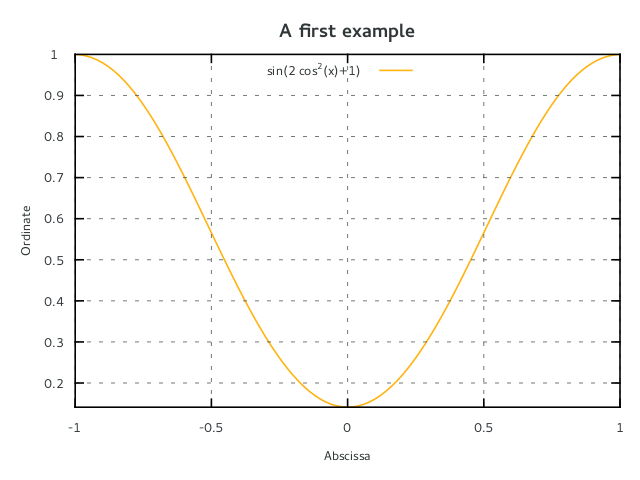
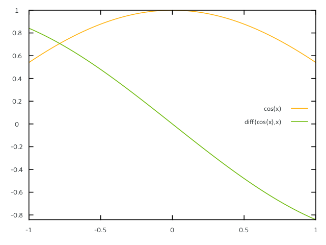

# The `tfel-plot` project

The `tfel-plot` project is meant to create:

- a `C++11` library for generating `2D` plots.
- a drop-in replacement of `gnuplot` called `tplot`.

This project is based on:

- The [`TFEL` libraries](http://tfel.sourceforge.net).
- The [`Qt` framework](https://www.qt.io/) .

Compared to `gnuplot`, we wanted to introduced the following new
features:

- The ability to select a curve and modify its properties (color, line
  width, line style, etc..) interactively.
- The ability to use `tplot` from the command line.
- A widget that can be used in every `Qt` code.
- The `const`, `lock` and `nodeps` keywords.
- The ability to load `C` functions in shared libraries, such a the
  ones generated by the
  [`MFront` code generator](http://tfel.sourceforge.net).
- Usage of some features introduced by the `TFEL` project such as:
	- kriging interpolation.
	- the ability to differentiate functions using the `diff`
      operator.
- Support for themes.

## Examples 

The previous figure was generated by the following script using a
`gnuplot`-like syntax:

~~~~{.gnuplot}
a=2
f(x)=cos(x)**2
# The definition of g use function composition
g(x)=sin(a*f(x)+1)

set title "A first example"

set grid
set key center top
set xlabel "Abscissa"
set ylabel "Ordinate"

# The title uses Qt formatting abilities
plot g(x) t "sin(2 cos2(x)+1)"
~~~~

The same plot can also be generated directly from the command line:

~~~~{.bash}
tplot f:"sin(2*cos(x)**2+1)" -t "sin(2 cos2(x)+1)" -kh center --with-grid --upperTitle="A first example" --xlabel="Abscissa" --ylabel="Ordinate" -o example1.png
~~~~

### The `diff` operator for function differentiation

~~~~{.gnuplot}
set key right center
plot cos(x), diff(cos(x),x)
~~~~

### Importing functions from shared libraries using the `import` keyword

Consider the following `C++` file, which defines the `cos_wrapper`
function:

~~~~{.cpp}
#include<cmath>

extern "C" {

  double cos_wrapper(const double x){
    return std::cos(x);
  }
  
}
~~~~

This file can be used to create a shared library:

~~~~{.bash}
g++ -fPIC -DPIC cos_wrapport.cxx -o libExternalFunction.so --shared
~~~~

The `cos_wrapper` function can now be called directly from `tplot`:

~~~~{.gnuplot}
import<c> cos_wrapper(x) 'libExternalFunction.so'
plot cos_wrapper(x)
~~~~

# Versions, branches, tags

- the `master` branch follows the evolution of the `master` branch of
  the `TFEL` project
- the `rliv-1.1` follows the evolution of the 3.3.x series of the `TFEL`
  project.
- the `rliv-1.0` follows the evolution of the 3.2.x series of the `TFEL`
project.
- tag `tfel-plot-1.1` is meant to be build against
  `TFEL` 3.3.0
- tag `tfel-plot-1.0` is meant to be build against
  `TFEL` 3.2.0

<!-- Local IspellDict: english -->
